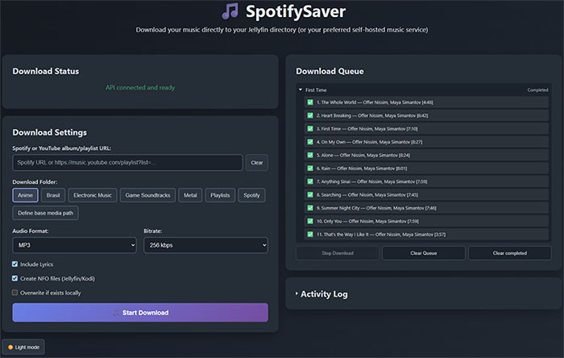

# SpotifySaver 🎵✨

[](https://www.python.org/)
[](https://pypi.org/project/spotifysaver/)
[](https://github.com/gabrielbaute/spotify-saver/pkgs/container/spotify-saver)
[](https://github.com/gabrielbaute/spotify-saver/pkgs/container/spotify-saver)
[](https://ffmpeg.org/)
[](https://github.com/yt-dlp/yt-dlp)
[](https://ytmusicapi.readthedocs.io/)
[](https://developer.spotify.com/)
[](https://opensource.org/licenses/MIT)
[](https://github.com/psf/black)
[](https://deepwiki.com/gabrielbaute/spotify-saver)

> ⚠️This repository is a fork from gabrielbaute's SpotifySaver. It's being developed with quality of life features I missed when using his tool. You can easily see the changes made by clicking [here](https://github.com/gabrielbaute/spotify-saver/compare/main...danilonishi:spotify-saver:main).

All-in-one tool for downloading and organizing music with Spotify metadata for Jellyfin.

The app connects to the Spotify and YouTube Music APIs, retrieves information from Spotify, locate the media on Youtube, downloads and extract the audio data, generates an .nfo XML file to complete the metadata required by Jellyfin when building music libraries.

## Changes in This Fork

<p align="center">
    
</p>

Compared with the upstream baseline, this branch adds:

- **A server-managed download queue:** Server controlled downloading means you can queue downloads, pause or resume them, and clear queued or completed items. Downloads continue if the browser is refreshed or closed; queue state is held in memory and does not survive an API server restart. The server currently processes one download at a time.
- **Queue and track visibility:** Download names and track listings are reported by the server and shown to other connected browsers, regardless if they're the one that submitted the download.
- **Simple download folders in the web UI:** Choose from folders under a configurable media root. Refreshing the page restores the last selected destination after reloading the page. A button for defining the root folder is available in the interface.
- **Web interface improvements:** Dark mode, collapsible album details and activity log, a clear-URL button for quick mobile pasting, and controls for clearing completed downloads.
- **Direct youtube downloads.** You can now paste any youtube video or playlist link, and it will download and extract the audio content.
- **M4A at 256 kbps as the default for API and web downloads.**
- **Download over 50 tracks per album or playlist.** Downloading large playlists were capped at 50 tracks due to Spotify list being paginated. This is fixed here.
- **Option to skip files.** Before, files were always redownloaded. Now a check is done before downloading.
- **Album-numbered playlist tracks.** Tracks were saved with playlist entry number as track number, now they use the album number. This helps avoid duplicate files.
- **Improved Spotify-youtube accuracy.** Often it matched wrong content from youtube. This will never be 100% but it's much better.


## 🌟 Features
- ✅ Download audio from YouTube Music with Spotify metadata
- ✅ Download YouTube videos, playlists, and album collections with YouTube metadata through the API and web UI
- ✅ Download YouTube playlists and album collections from the CLI
- ✅ Synchronized lyrics (.lrc) from LRC Lib
- ✅ Generate Jellyfin-compatible `.nfo` metadata files
- ✅ Automatic folder structure (Artist/Album)
- ✅ Command-line interface (CLI)
- ✅ Web interface (UI) with real-time progress
- ✅ Stop an active download from the web interface or API
- ✅ RESTful API for integrations
- ✅ Docker support with auto-builds
- ✅ Playlist support
- ✅ M4A and MP3 audio output
- ✅ Support for 96, 128, 192, and 256 kbps bitrates

### Requirements
- Python 3.8+
- FFmpeg
- [Spotify Developer Account](https://developer.spotify.com/dashboard/)

```bash
# Installation with Poetry (recommended)
git clone https://github.com/danilonishi/spotify-saver.git
cd spotify-saver
poetry install

# Or with pip
pip install git+https://github.com/danilonishi/spotify-saver.git
```

⚠️ Spotify URLs require a Spotify developer app with a client ID and client secret in the project's `.env` file. Direct YouTube downloads do not require Spotify credentials.

Spotify playlist access uses Spotify user authorization. Add `http://127.0.0.1:8888/callback` to the app's Redirect URIs in the Spotify Developer Dashboard. The first playlist request opens a Spotify login/authorization page; the resulting token is cached under `~/.spotify-saver`.

## ⚙️ Configuration

Once in your project directory, run:

```bash
spotifysaver init
```
This will create a local `.env` file with the environment variables that will be requested:

| Variable                  | Description                                | Default Value                     |
|---------------------------|--------------------------------------------|-----------------------------------|
| `SPOTIFY_CLIENT_ID`       | ID of the Spotify app you created          | -                                 |
| `SPOTIFY_CLIENT_SECRET`   | Secret key generated for your Spotify app  | -                                 |
| `SPOTIFY_REDIRECT_URI`    | Spotify API Validation URI                 | `http://127.0.0.1:8888/callback`  |
| `SPOTIFYSAVER_OUTPUT_DIR` | Custom directory path (optional)           | `./Music`                         |
| `YTDLP_COOKIES_PATH`      | Cookie file path (optional)                | -                                 |
| `API_PORT`                | API server port (optional)                 | `8000`                            |
| `API_HOST`                | Host for the API (optional)                | `0.0.0.0`                         |
| `UI_ENABLED`              | Enable/disable web interface (optional)    | `true`                            |

The variable `YTDLP_COOKIES_PATH` will indicate the location of the file with the Youtube Music cookies, in case we have problems with restrictions to yt-dlp, specifically it is for cases in which youtube blocks the app for "behaving like a bot" (~~which is not entirely false lol~~)

You can also check the .example.env file

## 📚 Documentation

The original maintainer of the repository owns a [documentation with Deepwiki](https://deepwiki.com/gabrielbaute/spotify-saver). You can consult it at all times.

⚠️ The original documentation on Deepwiki does not reflect changes in this repository.

The **documentation for using the API**, on the other hand, can be found in this same repository here: [API Documentation](API_IMPLEMENTATION_SUMMARY.md)

## 💻 Using the CLI

### Available Commands

| Command              | Description                                | Example                                    |
|----------------------|--------------------------------------------|--------------------------------------------|
| `init`               | Configure environment variables            | `spotifysaver init"`                       |
| `download [URL]`     | Download Spotify tracks/albums/playlists or YouTube albums/playlists | `spotifysaver download "URL"`      |
| `inspect`            | Shows Spotify metadata (album, playlist)   | `spotifysaver inspect "URL_SPOTIFY"`       |
| `show-log`           | Shows the application log                  | `spotifysaver show-log`                    |
| `version`            | Shows the installed version                | `spotifysaver version`                     |

### Download Options

| Option            | Description                                           | Accepted Values         ​​|
|-------------------|-------------------------------------------------------|-------------------------|
| `--lyrics`        | Download synchronized lyrics (.lrc)                   | Flag (no value)         |
| `--output DIR`    | Output directory                                      | Valid path              |
| `--format FORMAT` | Audio format                                          | `m4a` (default), `mp3`, `opus` |
| `--bitrate KBPS`  | Audio bitrate                                         | `96`, `128` , `192`, `256`(default) |
| `--cover/--no-cover` | Save Spotify cover or embed YouTube thumbnail | Flag (no value)      |
| `--nfo`           | Generates a .nfo metadata file in the JellyFin format | Flag (no value)         |
| `--explain`       | Show score breakdown for each track without downloading (for error analysis) | Flag (no value)         |
| `--dry-run`       | Simulate download without saving files                | Flag (no value)         |

### show-log Options

| Option      | Description                             | Accepted Values ​​              |
|-------------|-----------------------------------------|-------------------------------|
| `--lines`   | Number of log lines to display          | `--lines 25` --> `int`        |
| `--level`   | Filter by log level                     | INFO, WARNING, DEBUG, ERROR   |
| `--path`    | Displays the location of the log file   | Flag (no value)               |

## 💡 Usage Examples
```bash
# Set spotifysaver configuration
spotifysaver init

# Download album with synchronized lyrics
spotifysaver download "https://open.spotify.com/album/..." --lyrics

# Download album with metadata file; the cover is saved as cover.jpg by default
spotifysaver download "https://open.spotify.com/album/..." --nfo

# Download song in MP3 format
spotifysaver download "https://open.spotify.com/track/..." --format mp3

# Download a YouTube Music album or playlist with YouTube-provided tags
spotifysaver download "https://music.youtube.com/playlist?list=..."
```

The CLI accepts Spotify tracks, albums, and playlists, and YouTube playlists or album collections. Direct YouTube video URLs are supported by the web interface and API, but not by the CLI. Spotify playlist tracks are saved under their canonical artist/album folders, with playlist files kept separately in a `Playlists/` directory beside the configured output directory. Existing files are skipped by default; set the web interface's overwrite option or the API's `overwrite_existing` field to replace them.

## Usage with API

To use the API, you need to have the API server running. You can start it with the following command:

```bash
# Start the API server
spotifysaver-api
```

The server will run at `http://127.0.0.1:8000` by default. The API accepts Spotify track, album, and playlist URLs, as well as direct YouTube video and collection URLs. Active downloads can be cancelled with `POST /api/v1/download/{task_id}/cancel`. You can find the [API documentation here](API_IMPLEMENTATION_SUMMARY.md), which describes the technical aspects and usage in detail.

## 🖥️ Web Interface (UI)

SpotifySaver now includes a modern web interface that makes it easy to download music without using the command line:

```bash
# Start the API server with web interface
spotifysaver-api
```

This will start the API server with an integrated web interface that you can access at `http://127.0.0.1:8000`. The web interface provides:

- **Easy URL input**: Paste a Spotify track, album, or playlist link, a YouTube video, or a YouTube album/playlist link
- **Full configuration**: All download options available through an intuitive interface
- **Real-time progress**: Monitor download progress and see detailed logs
- **Download cancellation**: Stop an active download
- **Overwrite control**: Keep existing files by default or replace them on request
- **Responsive design**: Works on desktop and mobile devices
- **Automatic browser opening**: Opens your default browser automatically

### Web Interface Features:
- ✅ URL validation for Spotify and supported YouTube links
- ✅ Configurable audio format (M4A by default, or MP3) and bitrate (256 kbps by default)
- ✅ Toggle lyrics and NFO file generation
- ✅ Stop active downloads and choose whether to overwrite existing files
- ✅ Custom output directory
- ✅ Real-time download progress
- ✅ Activity log with timestamps
- ✅ Error handling and user feedback

**Default Access:**
- Web Interface & API: `http://127.0.0.1:8000`
- API Documentation: `http://127.0.0.1:8000/docs`

## 🐳 Docker Support

The original SpotifySaver is available as a Docker container with full web interface support. Choose between GitHub Container Registry or building locally.

⚠️ The docker repository does **not** have the features from this branch.

Please refer to https://github.com/gabrielbaute/spotify-saver for the original docker installation.

## 📂 Output Structure
```
.
├── Music/
│   ├── Artist/
│   │   └── Album (Year)/
│   │       ├── 01 - Song.mp3
│   │       ├── 01 - Song.lrc
│   │       ├── album.nfo
│   │       └── cover.jpg
│   └── YouTube/
│       └── Collection Name/
│           └── 01 - Video Title.mp3
└── Playlists/
    └── Playlist Name/
        └── Playlist Name.m3u
```
Direct YouTube videos are saved under an artist folder when artist metadata is available.

## 🤝 Contributions
1. Fork the project
2. Create your branch (`git checkout -b feature/new-feature`)
3. Commit your changes (`git commit -m 'Add awesome feature'`)
4. Push to the branch (`git push origin feature/new-feature`)
5. Open a Pull Request

## 📄 License

MIT © [TGabriel Baute](https://github.com/gabrielbaute)
